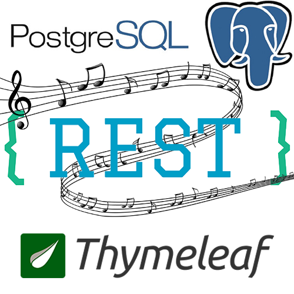
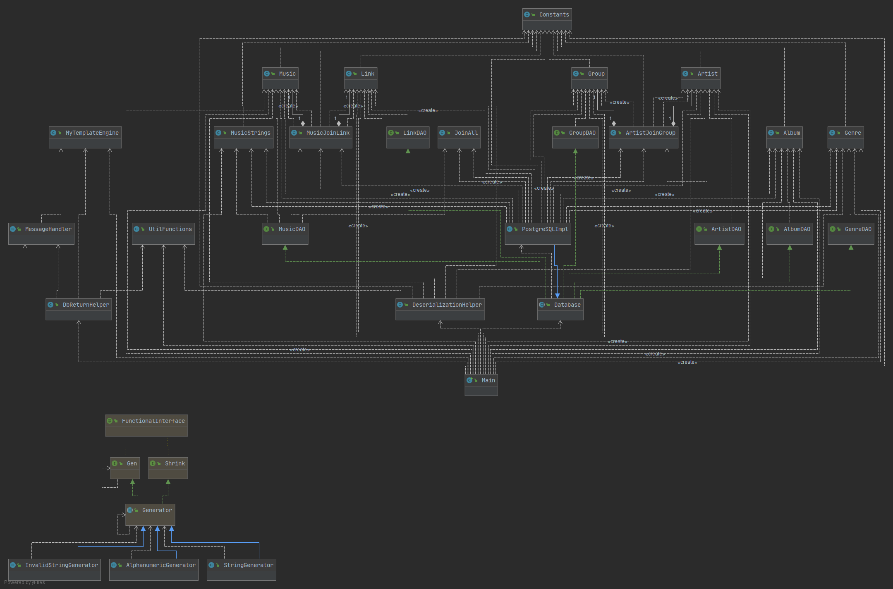
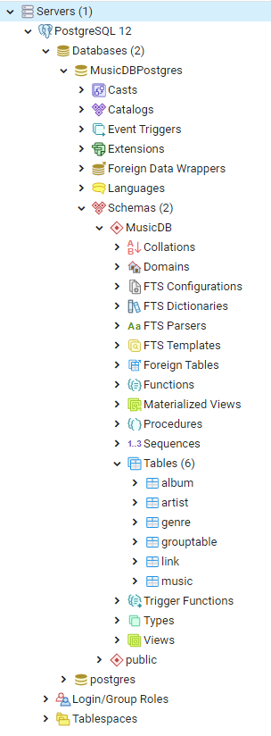
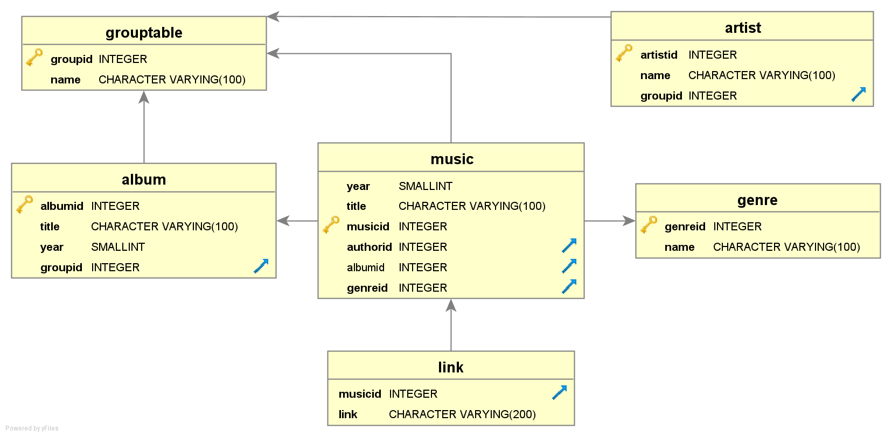

# Progetto per l'esame di Ingegneria del Software Avanzata
 

## Introduzione
Il progetto è una semplice applicazione Web che permette agli utenti di gestire un database di musica. Questo
progetto è un'estensione di quello sviluppato per l'esame di Tecnologie per le Basi di Dati, al quale sono
state aggiunte varie funzionalità, migliorie all'usabilità da parte dell'utente e all'interfaccia grafica,
test automatici (compreso un test lato Client tramite [Selenium](https://www.selenium.dev)), e sul quale è
stato fatto del refactoring in modo da rendere il codice più compatto e meno ripetitivo.

Questa applicazione Web permette agli utenti di:
- Visualizzare, modificare, inserire ed eliminare canzoni, album, artisti, gruppi musicali e generi musicali
- Visualizzare e inserire link alle tracce musicali (possono essere link youtube, soundcloud, spotify...)
- Cercare canzoni tramite testo libero (la ricerca è effettuata sia sul titolo che sull'album, genere, autore, ...)
- Visualizzare le canzoni comprese in un album, quelle composte da un certo artista o gruppo musicale e quelle di
un certo genere
- Visualizzare tutti i link per una determinata traccia musicale

## Architettura del sistema
L'architettura del sistema è un'architettura a strati di tipo MVC. Il Controller si occupa di effettuare il
routing delle richieste. Il Model contiene i modelli delle tabelle nel database (più altri modelli utili per la
visualizzazione delle tabelle di join). Le View vengono popolate di dati lato server per poi essere mostrate all'utente.

Le richieste dell'utente vengono gestite secondo le linee guida dello stile architetturale ReST (sono state implementate
solo quelle che si sono ritenute necessarie):
- GET su collezione -> Ottenere una lista di risorse
- GET su risorsa -> Ottenere una rappresentazione della risorsa
- PUT su risorsa -> Modificare la risorsa
- POST su collezione -> Inserire di una nuova risorsa
- DELETE su risorsa -> Eliminare della risorsa

## Diagramma UML
Il diagramma UML, generato automaticamente dall'IDE IntelliJ IDEA, è il seguente:

## Funzionamento del sistema
La classe Main fa partire il Web server e si occupa di effettuare il routing e il dispatching delle richieste. \
La classe Database fornisce un'astrazione a (eventualmente) più classi che interrogano database potenzialmente
diversi; è stata implementata una sola classe PostgreSQLImpl che si occupa di interrogare il database Postgres
mostrato nella sezione successiva. \
Varie classi sono state create per effettuare il refactoring del codice e per separare le responsabilità dei
moduli: DbReturnHelper fornisce metodi che incapsulano le interrogazioni al database; DeserializationHelper
incapsula la deserializzazione dei modelli a partire dai parametri passati nell'URL (più altre funzioni);
MessageHandler si occupa di restituire all'utente diversi messaggi di successo o fallimento delle operazioni
richieste. \
La classe Constants contiene le costanti, quali i nomi delle tabelle e dei campi nel database e il numero di risultati
per pagina (per le query che supportano la paginazione).

## Tecnologie utilizzate
Come gestore delle dipendenze e build tool si è usato [Gradle v5.2.1](https://gradle.org/). \
Si è utilizzato il framework [SparkJava](http://sparkjava.com/), un framework molto semplice per la creazione
di applicazioni Web. Esso utilizza, internamente, un Web server Jetty. \
Come Database si è scelto di utilizzare [PostgreSQL v12.3](https://www.postgresql.org/). \
Per quanto riguarda le view si sono utilizzati i template [Thymeleaf](https://www.thymeleaf.org/). \
I test automatici vengono effettuati tramite [JUnit 5](https://junit.org/junit5/) e, quando necessario
per alcune librerie come [Selenium](https://www.selenium.dev), [JUnit 4](https://junit.org/junit4/). \
Si è fatto uso di [JUnit Quickcheck](https://github.com/pholser/junit-quickcheck) per effettuare il
property-based testing. \
Inoltre si è utilizzato [Mockito](https://site.mockito.org/) per testare la classe DbReturnHelper. \
Le altre dipendenze, meno significative, si possono visualizzare consultando il file build.gradle.

### Database
#### Struttura
La struttura del database è la seguente: \

Il file musicdbdump.sql contiene un dump del database con qualche dato inserito, il che può essere
utile per testare l'applicazione. Il dump è stato eseguito tramite il seguente comando:

    pg_dump.exe -U postgres -W -F p MusicDBPostgres > musicdbdump.sql

<b>Attenzione:</b> Il comando è stato eseguito tramite il command prompt ("cmd") di Windows; se si prova a
ripristinare il dump tramite PowerShell verranno dati degli errori. E' necessario utilizzare "cmd".
#### Schema logico
Lo schema logico è il seguente:
 \
Gli attributi in grassetto significano che il campo è "NOT NULL", le freccette blu indicano le chiavi esterne,
le chiavi indicano le chiavi primarie.
#### Connessione
La connessione al database avviene tramite JDBC, in particolare tramite la classe PGSimpleDataSource della libreria
org.postgresql.ds. Per connettersi al database utilizzando il metodo "classico" DriverManager.getConnection(), la
stringa da utilizzare è la seguente (senza i parametri, l'applicazione non riesce a vedere il database "MusicDBPostgres"
e lo schema "MusicDB", ma vede solamente il DB di default "postgres" e il suo schema "public").

    jdbc:postgresql://localhost:5432/MusicDBPostgres?currentSchema=MusicDB

### Test automatizzati
Questo progetto prevede alcuni test automatizzati. Essi sono suddivisi in unit test ed integration test. \
Gli unit test che sono stati realizzati sono volti a testare i modelli (tramite property-based testing)
ed alcune funzionalità del database (tutte le funzioni "get" e "join"). Vengono anche testati i metodi della
classe DbReturnHelper; ciò viene fatto con l'aiuto di Mockito. \
In conclusione, negli integration test viene quindi testata una classe alla volta, un metodo alla volta.

Gli integration test testano invece le interazioni fra metodi e quelle fra classi (DatabaseAndModelTest)
ed il funzionamento corretto del sistema in un tipico caso d'uso, tramite la simulazione effettuata con
Selenium (SeleniumTest). Quest'ultimo test simula l'interazione dell'utente con il browser, cliccando su link
e bottoni e scrivendo nelle caselle di testo. Ulteriori dettagli sui test potranno essere discussi in sede d'esame.

### Documentazione
Un primo esempio di Javadoc si può trovare nella cartella "docs" del progetto. La documentazione prodotta non è esaustiva
e mira più a mostrare la tipologia di documentazione prodotta automaticamente da Gradle tramite il task "javadoc".
Le classi che sono state meglio documentate sono quelle del package restApp.